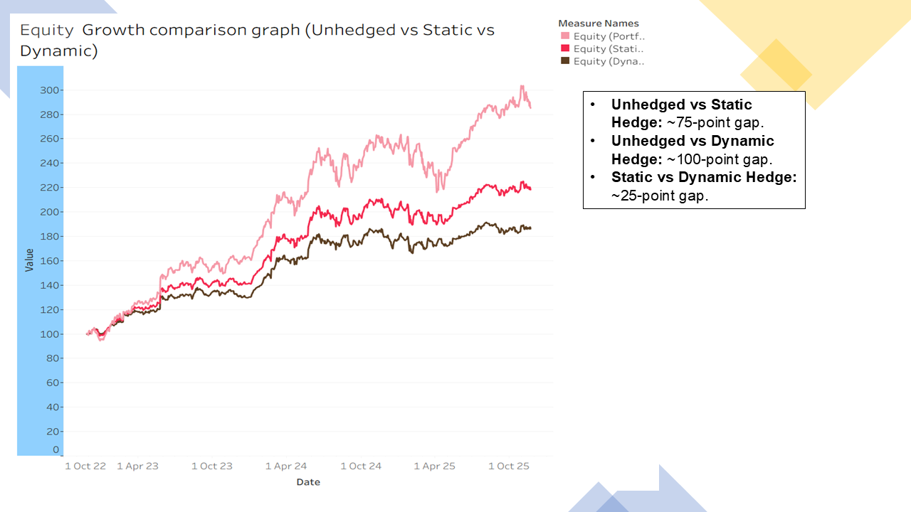
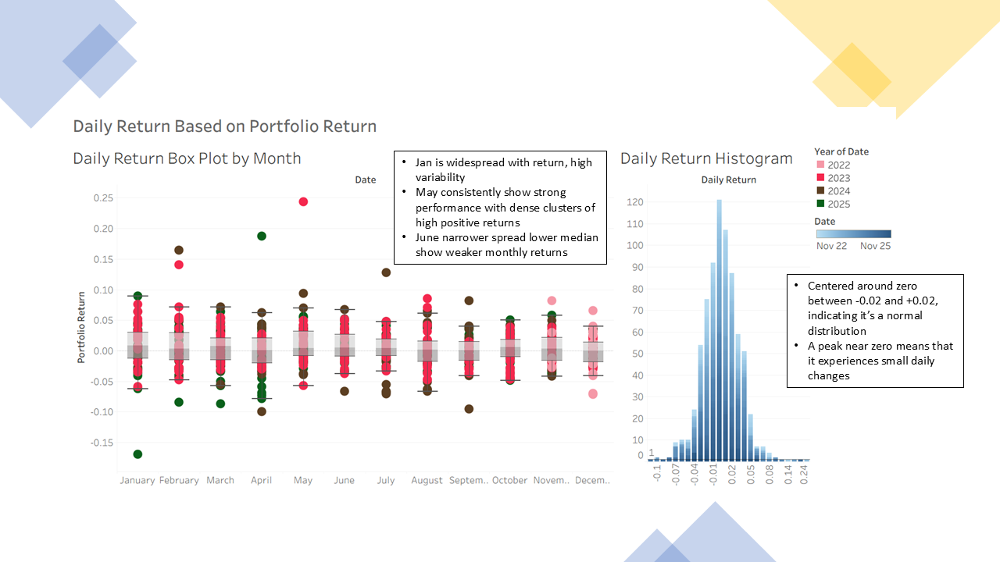
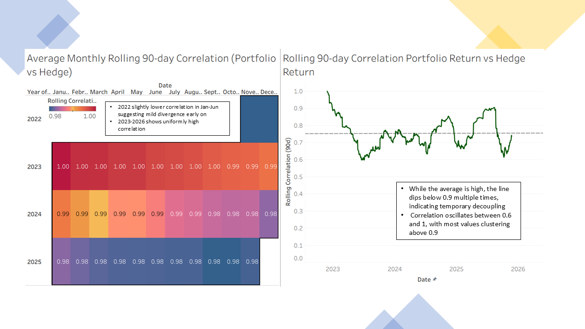
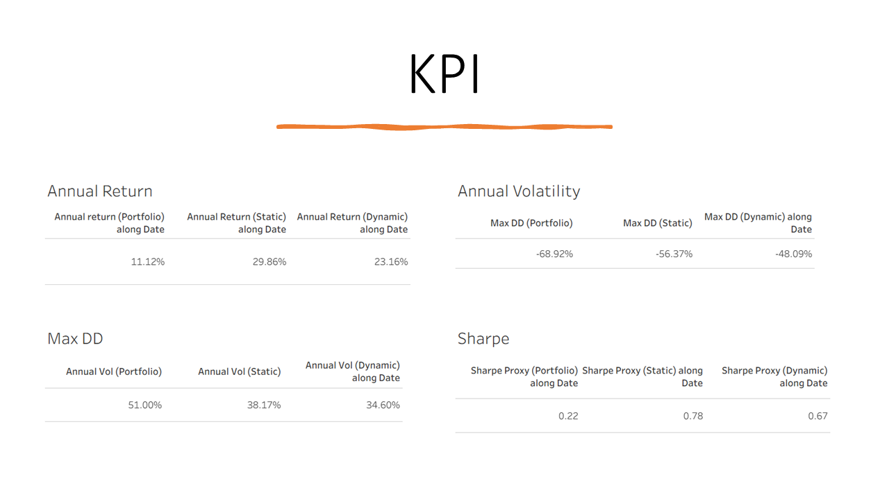
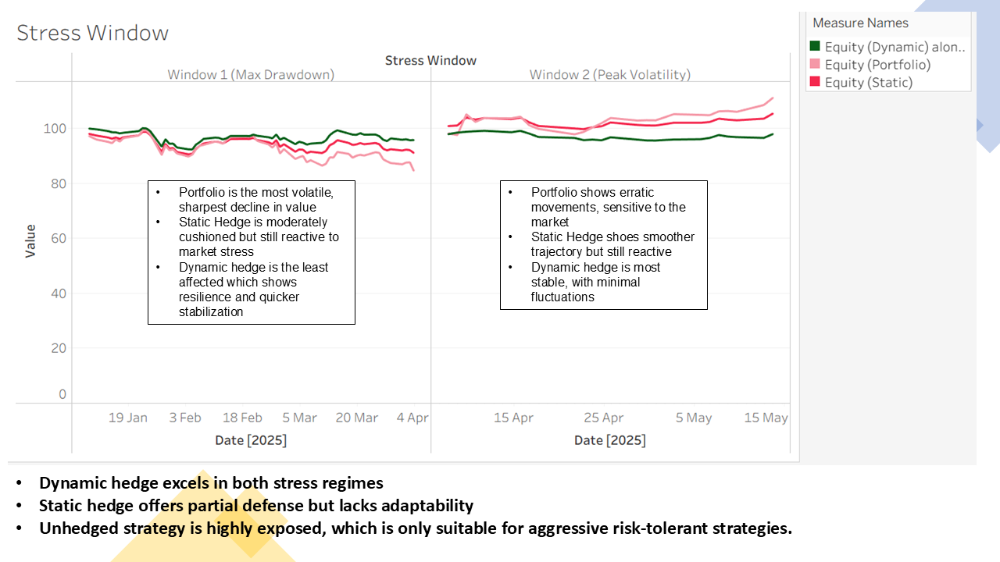
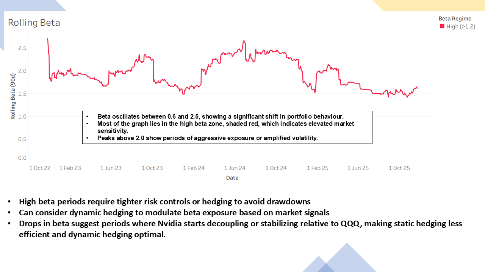

# Navigating Volatility: Portfolio Hedging with Nvidia and QQQ

**Capstone Project — Khin Chan Thar**

---

##  📌 Overview

This project investigates portfolio hedging strategies for a high-growth, high-volatility asset (Nvidia / NVDA) using the Invesco QQQ Trust as a hedging instrument. It compares three portfolio strategies — **unhedged**, **static hedge**, and **dynamic hedge** — across multiple performance and risk dimensions, using historical data from 2022 to 2025.

The analysis includes return heatmaps, rolling correlation and beta analysis, drawdown stress testing, and KPI benchmarking to arrive at actionable recommendations for different investor profiles.

---

## 🗂️ Assets

| Asset | Ticker | Role |
|---|---|---|
| Nvidia | NVDA | Primary asset — high-growth, high-volatility |
| Invesco QQQ Trust | QQQ | Hedge instrument — Nasdaq-100 proxy |

**Why Nvidia?** NVDA has become the backbone of the AI boom, powering large language models and generative AI platforms. It trades at premium valuations and is highly sensitive to shifts in AI demand.

**Why QQQ?** QQQ tracks the 100 largest non-financial Nasdaq companies and serves as a broad proxy for US tech sector performance. It provides diversification across tech giants (Apple, Microsoft, Amazon) while remaining correlated enough to act as an effective hedge.

---

## 🧐 Strategies Compared


- **Unhedged** — Full NVDA exposure, no hedge. Highest return potential but maximum drawdown risk.
- **Static Hedge** — Fixed QQQ hedge ratio. Balanced growth with moderate downside protection.
- **Dynamic Hedge** — Adaptive hedge ratio, triggered by rolling beta and correlation signals. Prioritises capital preservation.

---

## 🔍 Key Findings


### Return Analysis
- Peak months historically are **January** and **May**, with May 2023 being exceptionally strong following Nvidia's major generative AI and data centre announcements.
- 2024 delivered the most consistent high returns across the portfolio, likely driven by favourable macro conditions and effective hedging.
- Q1 momentum (January–March) is a recurring pattern across all observed years.

### Correlation & Beta



- Rolling 90-day correlation between NVDA and QQQ oscillates between **0.65 and 1.00**, with most values clustering above **0.9**.
- Rolling beta fluctuates between **0.6 and 2.5**, indicating significant shifts in market sensitivity over time.
- Periods where beta exceeds **2.0** signal elevated risk and warrant tighter hedging controls.


### Strategy Performance



| Metric | Unhedged | Static Hedge | Dynamic Hedge |
|---|---|---|---|
| Return | Highest | Moderate | Lower |
| Sharpe Ratio | Lowest | **Highest** | Moderate |
| Max Drawdown | Worst | Moderate | **Best** |
| Volatility | Highest | Moderate | **Lowest** |

- The **unhedged strategy** leads in raw performance but is the most exposed during downturns.
- The **static hedge** offers the best risk-adjusted return (highest Sharpe ratio).
- The **dynamic hedge** excels at capital preservation, with the smallest drawdown and lowest volatility.

### Stress Testing

- During peak stress regimes, dynamic hedging reduces short-term losses by over **5%** compared to the unhedged portfolio.
- The static hedge provides partial defence but lacks the adaptability of the dynamic approach.

---

## 💡 Recommendations

| Investor Profile | Recommended Strategy | Rationale |
|---|---|---|
| Balanced (e.g., pension funds, endowments) | **Static Hedge** | Best risk-adjusted returns; stable and consistent |
| Risk-averse / capital preservation focus | **Dynamic Hedge** | Minimal drawdown; adaptive to regime changes |
| Aggressive growth-oriented | **Unhedged** | Only suitable when growth outweighs drawdown concerns |

### 🛠️ Implementation Guidelines


- Use the **Rolling Beta Dashboard** to monitor regime shifts; activate dynamic hedging when beta exceeds **1.2**.
- Use **90-day rolling correlation** as a regime-change warning system.
- When the 90-day correlation is low or unstable, layer in **protective puts** to guard against abrupt shocks that beta-based strategies may miss.
- Switch from static to dynamic hedging when the rolling beta or correlation shows sustained deviation from historical averages.

---

## 📂 Project Structure

```
📊 [Presentation Slides](14684190_KhinChan_Thar_Capstone_Project.pptx)
📈 [Tableau] (14684190_KhinChan_Thar_Capstone_Project.twbx)
📋 [Report] (14684190_KhinChan_Thar_Capstone_Report.docx)


```

---

## Author

**Khin Chan Thar**  
Capstone Project — Portfolio Risk Management
